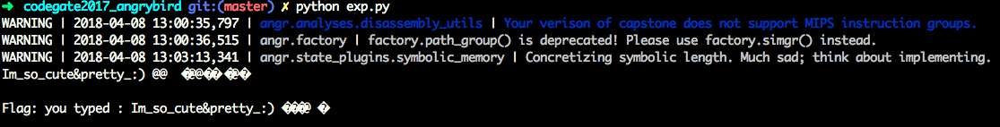

# Pwn
#0blog

## [Angr]codegate2017_angrybird

很清新的程序流程。。。 一飞冲天，威力无比～～


运行后直接退出，哈？？？然后把前边三个函数全部nop掉。看起来流程就是不停的判断，字符不对的话就直接退出。所以终极目标就选成了printf函数的下一个位置。

哦，错了，patch完的效果如下：





```python
import angr

main = 0x4007C2
find = 0x404FC1
avoid = [0x4005E0]#exit

p = angr.Project('./angrybird_patched')
init = p.factory.blank_state(addr=main)
pg = p.factory.path_group(init, threads=8)
ex = pg.explore(find=find, avoid=avoid)

final = ex.found[0].state
print("Flag: {0}".format(final.posix.dumps(1)))

```
